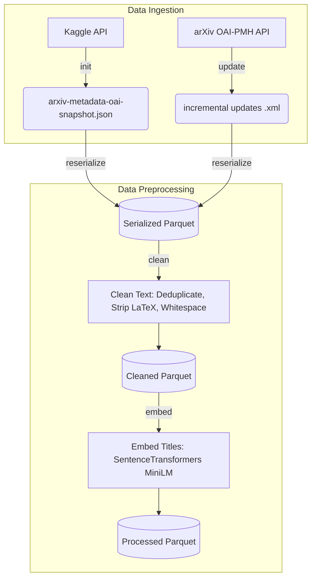

# Data Pipeline Overview

This document explains the data ingestion and preprocessing pipeline for the MLOps-Patent project. The pipeline securely pulls raw arXiv paper data, normalizes it, and encodes semantic embeddings for downstream novelty detection.

## Pipeline Architecture

The pipeline consists of two primary modules: **Data Ingestion** and **Data Preprocessing**.



## 1. Data Ingestion

The CLI (`patent/cli.py data`) handles the acquisition of raw data. It supports bootstrapping a large database via Kaggle and maintaining updating the data sequentially using the live arXiv API.

### Initial Fetch (Kaggle Integration)
To quickly bootstrap historical data without aggressively hitting the arXiv API, the pipeline can download the Kaggle `arxiv-metadata-oai-snapshot` dataset.

```bash
# Uses ~/.kaggle/kaggle.json credentials
uv run python patent/cli.py data init
```

### Incremental Updates (OAI-PMH API)
To fetch new papers or retrieve specific date ranges incrementally, use the `update` command. It manages internal pagination, API rate limits, and merges paginated `<record>` chunks into a unified `<collection>` XML file.

```bash
# Fetch data from March 1 to March 15 and output to the raw directory
uv run python patent/cli.py data update \
    --from-date 2026-03-01 \
    --to-date 2026-03-15 \
    --output-path data/raw/updates
```

## 2. Data Preprocessing

The preprocessing pipeline (`patent/cli.py data reserialize | clean | embed`) transforms the JSON and XML data into clean, embeddable feature vectors ready for the machine learning models.

### How it works:
1. **Reserializing (`data reserialize`)**: Reads either the Kaggle JSON, a directory of XML updates, or a single XML update file, and parses it into a Parquet format stored in `data/interim/serialized`.
2. **Cleaning (`data clean`)**: Reads the reserialized artifact, drops duplicates based on the paper's ID, strips inline LaTeX strings (e.g., `$\alpha = 1$`), strips excessive whitespaces, and applies lowercasing. Output goes to `data/interim/cleaned`.
3. **Embedding (`data embed`)**: Reads the clean parquet in chunks and passes the titles through the local HuggingFace `SentenceTransformers` model (`all-MiniLM-L6-v2`) to produce standard 384-dimensional numeric feature embeddings.
4. **Storage:** Saves the embedded dataset into a pickled and partitioned Parquet format in `data/processed` for efficient downstream loading.

### Running Preprocessing (End-to-End simulation)
Run sequentially over new updates:

```bash
# 1. Parse into Parquet DataFrame
uv run python patent/cli.py data reserialize data/raw/updates --output-path data/interim/serialized/updates.parquet

# 2. Clean Text Data
uv run python patent/cli.py data clean data/interim/serialized/updates.parquet --output-path data/interim/cleaned/updates.parquet

# 3. Vectorize Labels
uv run python patent/cli.py data embed data/interim/cleaned/updates.parquet --output-path data/processed/updates.parquet
```


