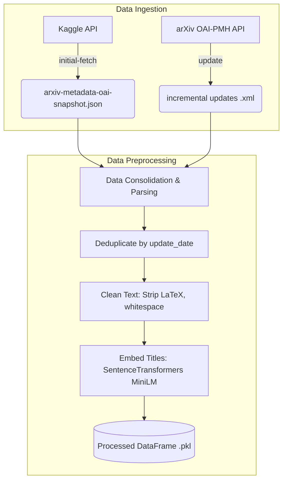

# Data Pipeline Overview

This document explains the data ingestion and preprocessing pipeline for the MLOps-Patent project. The pipeline securely pulls raw arXiv paper data, normalizes it, and encodes semantic embeddings for downstream novelty detection.

## Pipeline Architecture

The pipeline consists of two primary modules: **Data Ingestion** and **Data Preprocessing**.



## 1. Data Ingestion

The data ingestion script (`patent/dataset/data_ingestion.py`) handles the acquisition of raw data. It supports bootstrapping a large database via Kaggle and maintaining updating the data sequentially using the live arXiv API.

### Initial Fetch (Kaggle Integration)
To quickly bootstrap historical data without aggressively hitting the arXiv API, the pipeline can download the Kaggle `arxiv-metadata-oai-snapshot` dataset.

```bash
# Uses ~/.kaggle/kaggle.json credentials
uv run python patent/dataset/data_ingestion.py initial-fetch --output-dir data/raw
```

### Incremental Updates (OAI-PMH API)
To fetch new papers or retrieve specific date ranges incrementally, use the `update` command. It manages internal pagination, API rate limits, and merges paginated `<record>` chunks into a unified `<collection>` XML file.

```bash
# Fetch data from March 1 to March 15 and output to the raw directory
uv run python patent/dataset/data_ingestion.py update \
    --from-date 2026-03-01 \
    --to-date 2026-03-15 \
    --output-dir data/raw
```

## 2. Data Preprocessing

The preprocessing script (`patent/dataset/preprocess.py`) transforms the JSON and XML data into clean, embeddable feature vectors ready for the machine learning models.

### How it works:
1. **Parsing:** Reads either the Kaggle JSON, a directory of XML updates, or a single XML update file.
2. **Deduplication:** Sorts all entries by `update_date` and drops duplicates based on the paper's ID, preserving only the most recent version.
3. **Text Cleaning:** Strips inline LaTeX strings (e.g., `$\alpha = 1$`), strips excessive whitespaces, and applies lowercasing. Papers with empty titles after cleaning are dropped.
4. **Vector Embedding:** Passes the titles through the local HuggingFace `SentenceTransformers` model (`all-MiniLM-L6-v2`) to produce standard 384-dimensional numeric feature embeddings.
5. **Storage:** Saves the augmented Pandas DataFrame into a pickled (`.pkl`) format for efficient downstream loading.

### Running Preprocessing (Batch Directory)
Run over an entire directory of XML files (best for bulk initialization):

```bash
uv run python patent/dataset/preprocess.py \
    --xml-dir data/raw \
    --output-path data/processed/encoded_dataset.pkl
```

### Running Preprocessing (Single File / Airflow Simulation)
Run over a discrete XML file (best for scheduled sequential orchestration):

```bash
uv run python patent/dataset/preprocess.py \
    --xml-file data/raw/arxiv_updates_2026-03-01_to_2026-03-03_073527.xml \
    --output-path data/processed/arxiv_updates_2026-03-01.pkl
```


